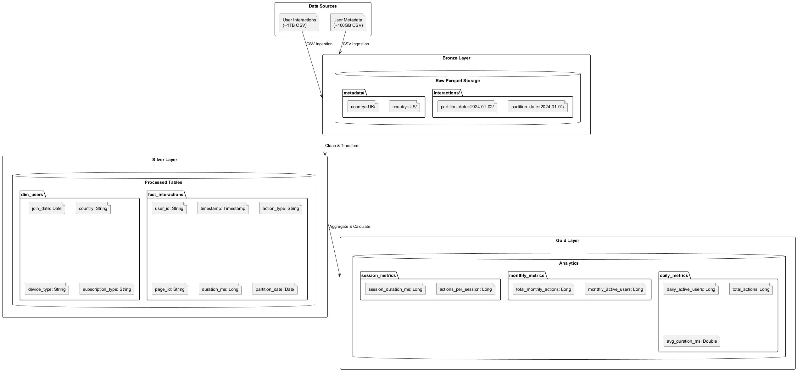

# Note-Taking App Analytics Pipeline

## Overview
This documentation outlines my solution for processing and analyzing user interaction data. The pipeline is built using Apache Spark and follows a modern data lakehouse architecture with bronze, silver, and gold layers for optimal data processing and analytics.

## Data Architecture



### Storage
- **Storage System**: MinIO (S3-compatible storage)
- **Data Format**: Parquet (columnar storage)
- **Partitioning Strategy**: 
  - Interactions data: Partitioned by date
  - User metadata: Partitioned by country

### Data Layers
1. **Bronze Layer**: Raw data ingested from CSV sources
2. **Silver Layer**: Cleaned and transformed data in fact/dimension model
3. **Gold Layer**: Pre-aggregated metrics and analytics

### Scalability Features

1. **Efficient Data Storage**
   - Parquet format for columnar compression
   - Date-based partitioning for quick data access
   - Partition pruning during query execution

2. **Incremental Processing**
   - Daily incremental updates instead of full reprocessing
   - Lookback windows for handling period boundaries
   - Partition-based writes for atomic updates

3. **Performance Optimizations**
   - Pre-aggregated metrics in gold layer
   - Broadcast joins for dimension tables
   - Caching of frequently accessed DataFrames

### Usage

1. **Daily Processing**
```python
etl = DataLakehouseETL()
metrics = etl.create_gold_layer(datetime.now().date())
```

2. **Historical Backfill**
```python
etl.backfill_gold_metrics(
    start_date=datetime(2023, 1, 1).date(),
    end_date=datetime(2023, 12, 31).date(),
    parallel=True
)
```

## Tasks

1. Calculate Daily Active Users (DAU) and Monthly Active Users (MAU) for the past year:
   - Define clear criteria for what constitutes an "active" user
   ```
   An active user is defined based on the following criteria:
   - Any user who performs at least one interaction (page_view, edit, create, delete, share) within the measurement period
   - Duration of interaction must be valid (between 0 and 2 hours)
   - Duplicate interactions within the same timestamp are excluded
   ```

   - Implement a solution that scales efficiently for large datasets
   ```
   1. Partitioning Strategy
   - Data is partitioned by date in the bronze layer
   - Enables efficient processing of daily increments
   - Supports parallel processing of different date partitions

   2. Incremental Processing
      - Daily runs process only the latest partition
      - Monthly metrics are updated incrementally
      - Historical data remains immutable

   3. Performance Optimizations
      - Efficient use of partitioning for data locality
      - Broadcast joins for dimension tables
      - Pre-aggregation of metrics for the gold layer
   ```

   - [Optional] Explain how you:
     - Handle outliers and extremely long duration values, OR
     - Describe challenges you might face while creating similar metrics and how you would address them
     ```
      Outlier Detection and Handling
      - Duration outliers: Filtered out interactions longer than 2 hours
      - Duplicate events: Removed using composite key deduplication
      ```

2. Calculate session-based metrics:
   - Calculate metrics including:
     - Average session duration
     - Actions per session
   - Define clear criteria for what constitutes a "session"
   ```bash
   A session is defined based on the following criteria:
   - A sequence of user interactions where the time gap between consecutive actions is less than 30 minutes
   - Session starts with the first interaction or after a 30+ minute gap
   - Session ends when either:
   - No activity for 30+ minutes
   - User day changes (midnight boundary)
   - Last known interaction of the user
  ```